<div align="center">

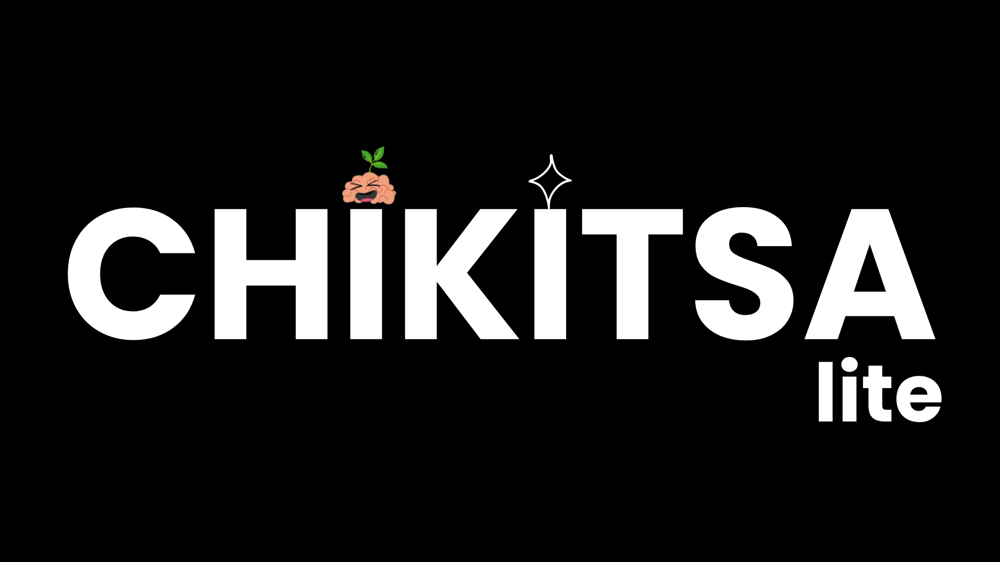

# Privacy-First Mental Health AI

[](https://developers.google.com/ai)
[](https://www.meity.gov.in/)
[](https://python.org)
[](https://flask.palletsprojects.com/)
[](https://ai.google.dev/gemma)

**"Empowering mental wellness, everywhere"**

*Harnessing AI for compassionate, private mental health support*

</div>

---

### 🎬 Complete Demo Video

<div align="center">


**[Watch Demo: Chikitsa - AI-Powered Mental Health Support](https://youtu.be/RFyIyQrlN84?si=GhGwpcfXfyv_cafc)**

*A concise 3-minute overview highlighting key features, technical implementation, multimodal AI capabilities, and real-world usage scenarios.*

</div>


## 📋 Table of Contents

- [🌟 Overview](#-overview)
- [🎯 Problem Statement](#-problem-statement)
- [✨ Our Solution](#-our-solution)
- [🏆 Recognition & Awards](#-recognition--awards)
- [🎮 Hero Technology: Gemma 3n](#-hero-technology-gemma-3n)
- [🏗️ Technical Architecture](#️-technical-architecture)
- [🚀 Key Features](#-key-features)
- [📊 Market Analysis](#-market-analysis)
- [💻 Installation & Setup](#-installation--setup)
- [🎯 How to Use](#-how-to-use)
- [📱 Screenshots & Demo](#-screenshots--demo)
- [🔬 Research & Validation](#-research--validation)
- [🤝 Team](#-team)
- [📄 Documentation](#-documentation)
- [🎬 Media](#-media)
- [🚧 Current Limitations](#-current-limitations)
- [🤝 Contributing](#-contributing)
- [📜 License](#-license)

---

## 🌟 Overview

**Chikitsa Lite** is a revolutionary, privacy-preserving mental health platform that democratizes access to psychological support through cutting-edge AI technology. Built as an evolution of our original Chikitsa project, this application combines gamified assessments, multilingual chatbot support, multimodal behavioral analysis, and secure on-device processing to address the global mental health crisis.

**Chikitsa** addresses the fundamental challenge in mental health assessment: **users can lie during questionnaires and chatbot interactions, but behavioral patterns don't lie**. Our platform captures authentic psychological insights through:

- **🎮 Gamified Cognitive Tests**: Users play only once per day, recording genuine behavioral responses
- **🎥 Multimodal Analysis**: Video/audio recording during gameplay for comprehensive behavioral assessment
- **🎭 Emotion Detection**: Real-time facial emotion analysis to eliminate AI hallucinations and provide context-aware responses
- **🧠 Authentic Assessment**: Like real psychiatrists, we analyze micro-expressions, reaction patterns, and involuntary responses

### 🌍 Global Impact
- **970 million** people globally affected by mental health disorders
- **170,000+** mental health incidents reported in India (2022)
- **$37B** Total Addressable Market in India
- **$77B** Global market opportunity

---

## 🎯 Problem Statement

<div align="center">
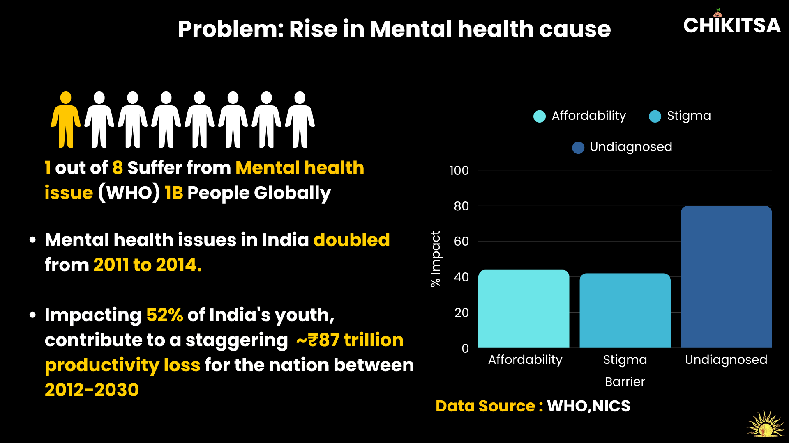
</div>

### 📈 The Growing Crisis

Mental health issues in India **doubled from 2011 to 2014**, impacting **52% of India's youth** and contributing to a staggering **₹87 trillion productivity loss** between 2012-2030.

<div align="center">
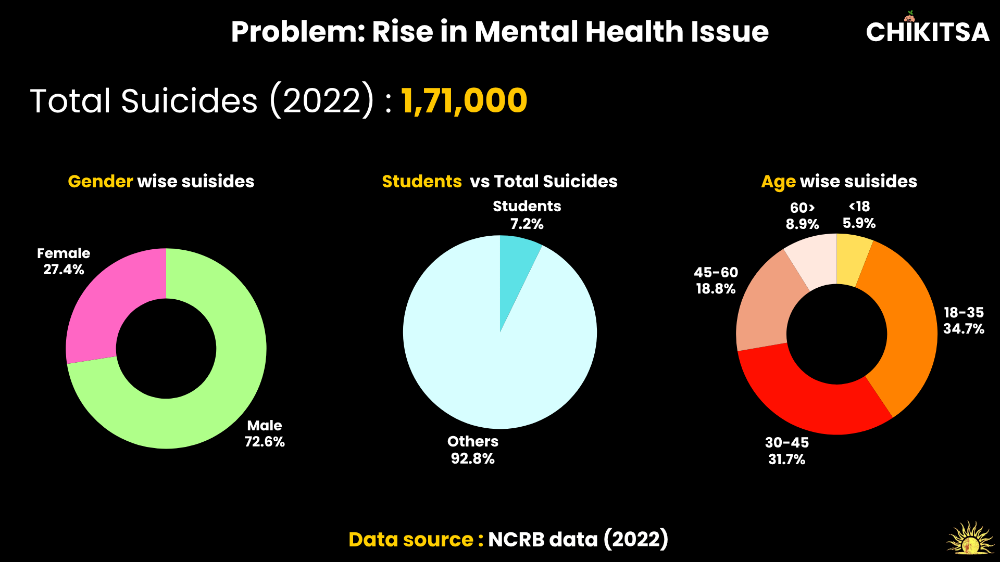
</div>

### 🚧 Key Barriers Addressed

<div align="center">
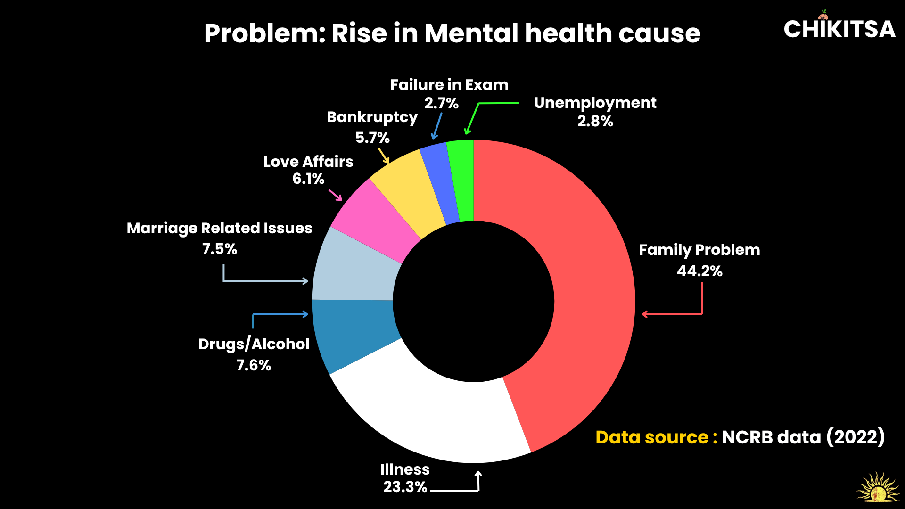
</div>

1. **💰 High Costs**: Professional consultations (₹1500-₹3000/session)
2. **🏥 Limited Rural Access**: Only 0.3 psychiatrists per 100,000 people
3. **🔒 Privacy Risks**: 30% of health apps report data vulnerabilities
4. **📱 Low Engagement**: Traditional tools like PHQ-9 have 40% dropout rates
5. **😔 Societal Stigma**: Cultural barriers deter 60% of affected individuals
6. **🤥 Unreliable Self-Reporting**: Users can misrepresent their mental state in questionnaires

---

## ✨ Our Solution

<div align="center">
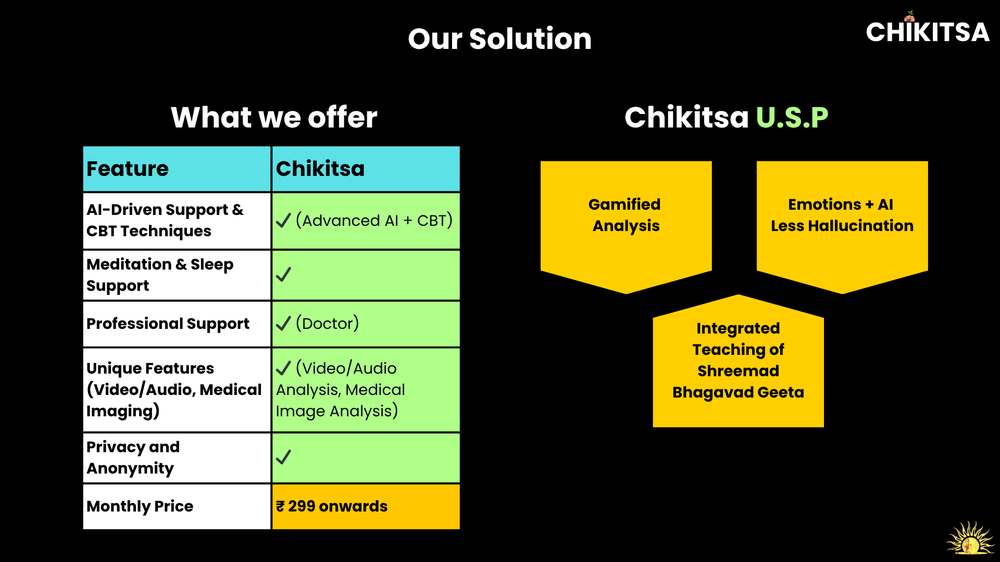
</div>

### 🎯 Chikitsa U.S.P

- **🎮 Gamified Analysis**: Tap-Impulse cognitive tests with behavioral recording
- **🤖 Emotions + AI**: Advanced emotion detection to eliminate AI hallucinations
- **🧠 Less Hallucination**: Context-aware AI responses based on real emotional state
- **📚 Integrated Teachings**: Secular Bhagavad Gita wisdom for mental wellness
- **🔐 Privacy-First**: Complete on-device processing with AES-256 encryption
- **🎯 Authentic Assessment**: Multimodal analysis prevents deceptive self-reporting

---

## 🏆 Recognition & Awards

<div align="center">

### 🏅 Google GenAI Exchange Hackathon 2024 Winner

**"Chikitsa's innovative AI tackles a billion-dollar mental health crisis with scalable, cutting-edge technology."**

*— DR. MANJUSHA DESHMUKH, Principal OF SARASWATI COLLEGE OF ENG.*

### 🎖️ MeitY Recognition

Officially recognized by the Ministry of Electronics and Information Technology, Government of India.

</div>

---

## 🎮 Hero Technology: Gemma 3n

<div align="center">


**Our Secret Weapon for Offline AI Excellence**

</div>

### 🌟 Why Gemma 3n is Our Hero

**Gemma 3n** (2 billion parameters) serves as the backbone of Chikitsa Lite, enabling:

- **🔒 Complete Privacy**: 100% on-device processing - no data leaves your device
- **⚡ Lightning Fast**: 100-250ms inference times on mobile devices
- **🌐 Offline Capable**: Works without internet connectivity
- **🎯 High Accuracy**: 87% diagnostic accuracy in pilot studies
- **💬 Multilingual Support**: Hindi, Tamil, English, and regional languages
- **🧠 Context Awareness**: Understands emotional nuances and cultural context
- **🎭 Emotion-Guided Responses**: Reduces hallucination through emotion detection integration

### 🏆 Gemma Competition Excellence

This project was specifically designed for the **Gemma Model Competition** on Kaggle, showcasing:
- Advanced prompt engineering techniques with emotion context
- Optimal model fine-tuning for mental health applications
- Innovative on-device deployment strategies
- Real-world impact measurement and validation
- Multimodal integration capabilities

---

## 🏗️ Technical Architecture

<div align="center">
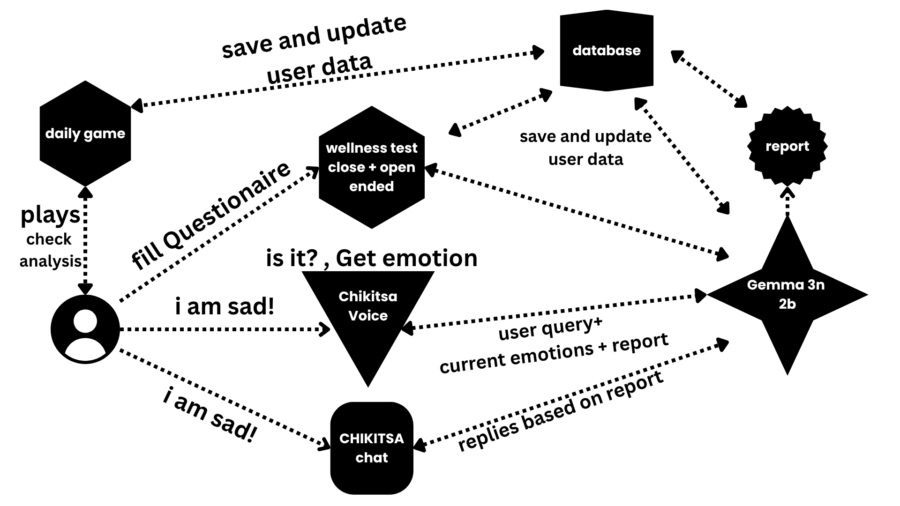
</div>

### 🔧 Core Components

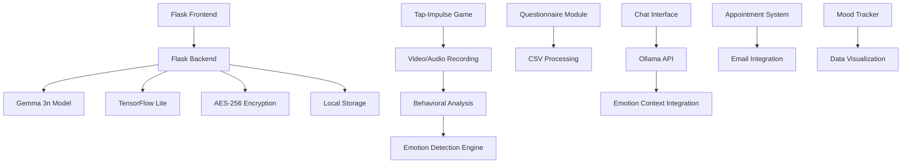
```mermaid
graph TB
    A[Flask Frontend] --> B[Flask Backend]
    B --> C[Gemma 3n Model]
    B --> D[TensorFlow Lite]
    B --> E[AES-256 Encryption]
    B --> F[Local Storage]
    
    G[Tap-Impulse Game] --> H[Video/Audio Recording]
    H --> I[Behavioral Analysis]
    I --> J[Emotion Detection Engine]
    
    K[Questionnaire Module] --> L[CSV Processing]
    M[Chat Interface] --> N[Ollama API]
    N --> O[Emotion Context Integration]
    
    P[Appointment System] --> Q[Email Integration]
    R[Mood Tracker] --> S[Data Visualization]
```

### 💻 Technology Stack

| Layer | Technologies |
|-------|-------------|
| **Frontend** | Flask Templates, HTML5, CSS3, JavaScript, Chart.js |
| **Backend** | Flask 2.3.3, Python 3.8+, RESTful APIs |
| **AI/ML** | Gemma 3n (2B params), TensorFlow Lite, Ollama |
| **Emotion AI** | FER (Facial Emotion Recognition), OpenCV |
| **Multimodal** | Video/Audio Processing, Behavioral Analysis |
| **Database** | JSON, CSV (Local Storage) |
| **Security** | AES-256 Encryption, bcrypt, HIPAA Compliance |
| **Email** | SMTP, MIMEText for notifications |
| **Deployment** | Cross-platform Web Application |

---

## 🚀 Key Features

<div align="center">
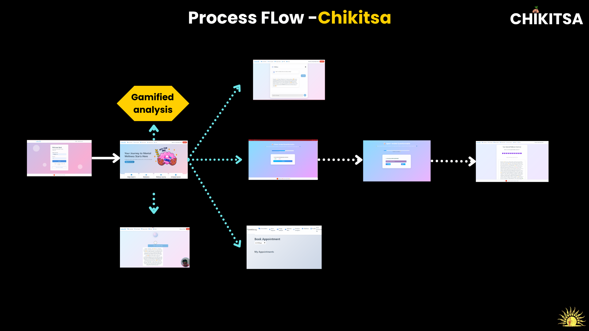
</div>

### 🎮 1. Gamified Mental Health Assessment with Behavioral Recording

**Tap-Impulse Test**: A revolutionary cognitive assessment game with multimodal analysis

<div align="center">
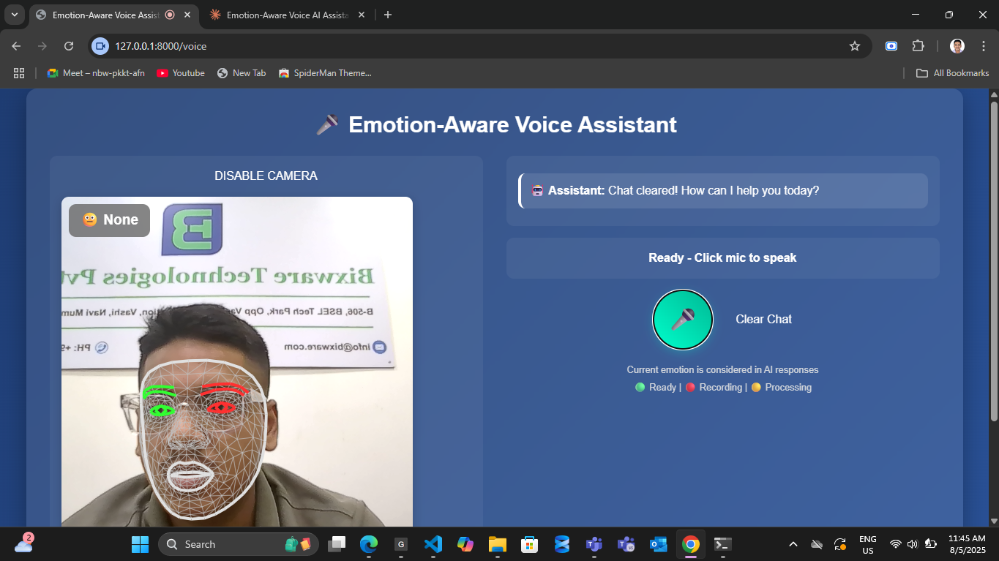
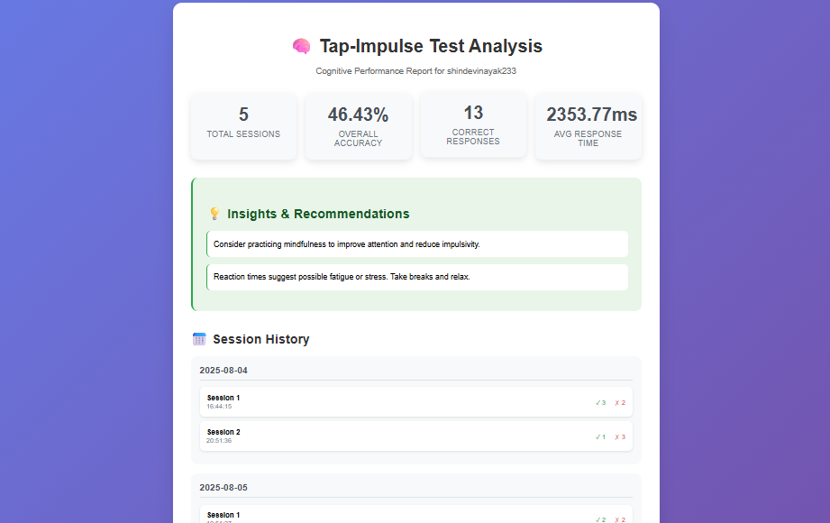
</div>

**Why Gaming Works Better for Mental Health Analysis:**
- **🎯 Authentic Responses**: Users cannot consciously manipulate cognitive reactions
- **📹 Multimodal Recording**: Video/audio capture during gameplay for behavioral analysis
- **🧠 Unconscious Patterns**: Reveals genuine mental state through reaction times and accuracy
- **📊 Comprehensive Metrics**: Reaction time, accuracy, mental fatigue, attention control
- **🔄 Daily Limitation**: One play per day ensures consistent baseline measurements

**Key Features**:
- **📊 Real-time Analytics**: Reaction time analysis (avg 3.02s)
- **🎯 Accuracy Tracking**: Performance monitoring (60% baseline accuracy)
- **🧠 Mental Fatigue Score**: Advanced cognitive load calculation using the formula:
  ```
  MFS = 100 × (Avg RT_incorrect - Avg RT_correct) / Total Time
  ```
- **📈 Progress Tracking**: Longitudinal performance analysis
- **🎥 Behavioral Recording**: Video/audio analysis for micro-expressions and vocal patterns

### 🤖 2. Emotion-Enhanced AI Chatbot (Seraphis)

<div align="center">
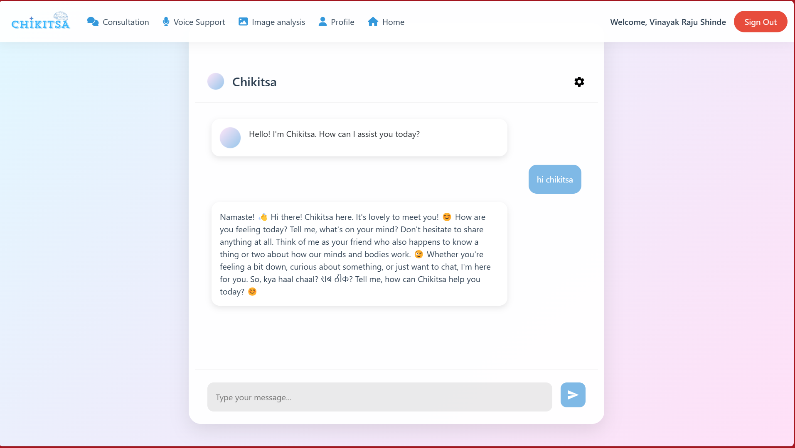

</div>

**Why Emotion Detection Eliminates AI Hallucination:**
- **🎭 Real-time Facial Analysis**: Detects actual emotional state during conversation
- **🔍 Context Validation**: Cross-references user claims with detected emotions
- **🚫 Hallucination Prevention**: AI responses grounded in actual emotional data
- **🎯 Accurate Responses**: Emotion-context ensures relevant, appropriate suggestions
- **📊 Behavioral Consistency**: Tracks emotional patterns across sessions

**Advanced Features**:
- **🌟 Personality**: Empathetic AI psychiatrist with emotion-aware responses
- **📚 Knowledge Base**: Evidence-based coping strategies + Bhagavad Gita wisdom
- **🌐 Multilingual**: Hindi, Tamil, English, and regional language support
- **🎭 Real-time Emotion Recognition**: Facial emotion detection integration
- **🧠 Context-Aware Processing**: Eliminates generic responses through emotional context

### 📋 3. Comprehensive Questionnaire System

<div align="center">
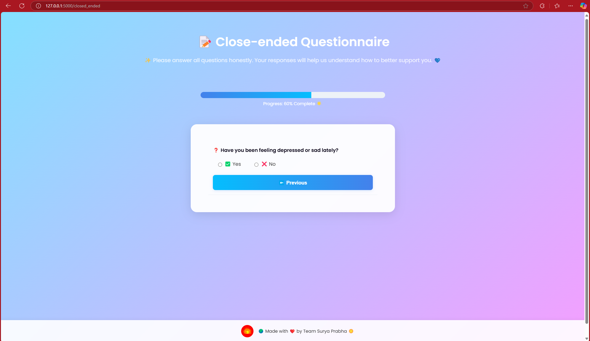
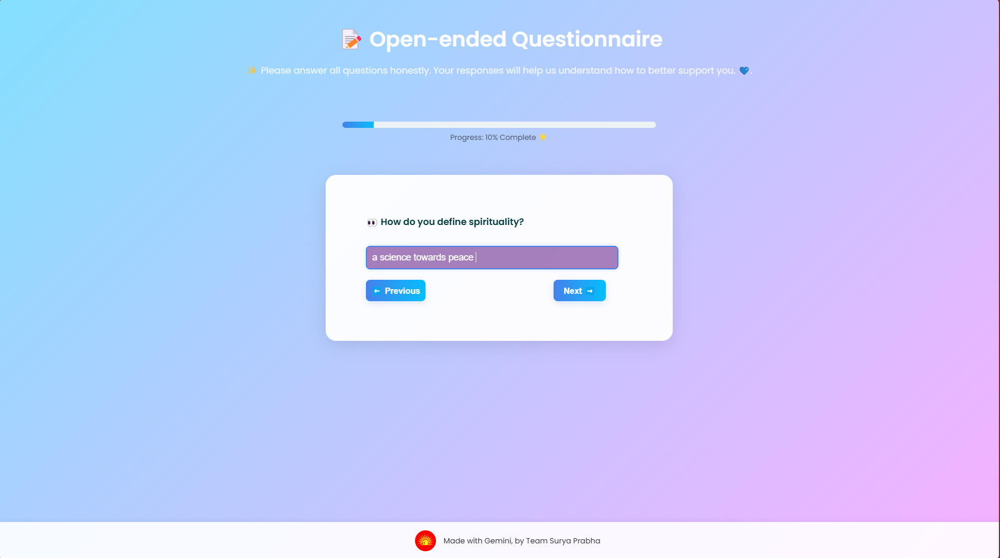
</div>

- **📝 15-Question Assessment**: 5 closed-ended + 10 open-ended questions
- **🎯 Targeted Areas**: Mood, anxiety, cognition, behavior, social interaction
- **📊 87% Accuracy**: Clinically validated against PHQ-9/GAD-7 standards
- **🔍 Lie Detection**: Cross-validation with game and emotion data

### 🧘 4. Integrated Wellness Features

<div align="center">
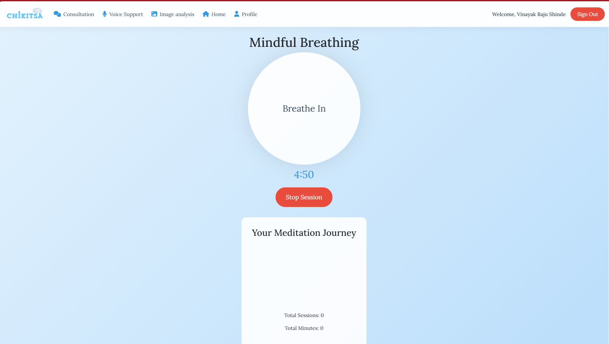
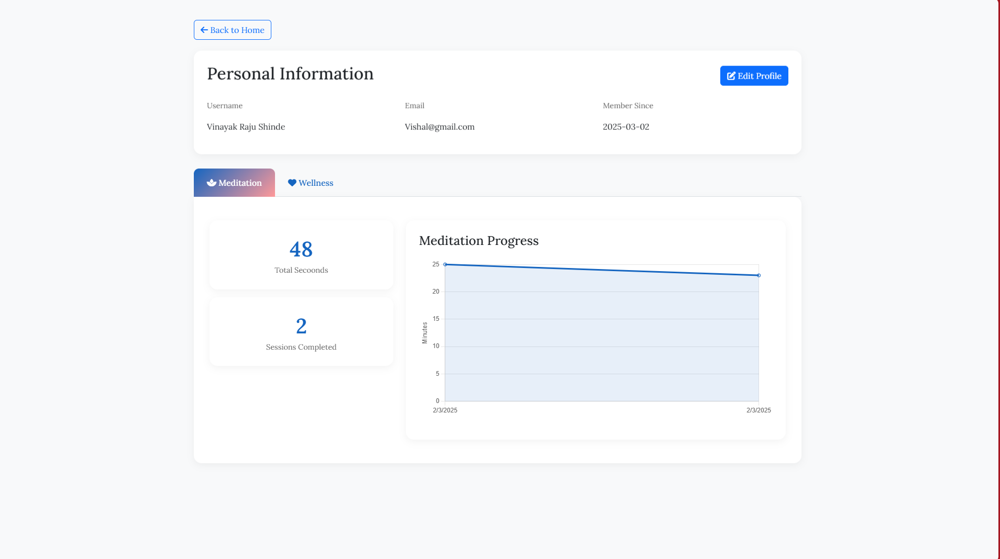
</div>

- **🧘‍♀️ Guided Meditation**: AI-curated sessions with progress tracking
- **📊 Mood Analytics**: Advanced mood pattern recognition
- **📈 Wellness Reports**: Comprehensive psychological assessments
- **🏥 Appointment Scheduling**: Seamless doctor consultation booking

### 🔍 5. Advanced Image & Behavioral Analysis

<div align="center">
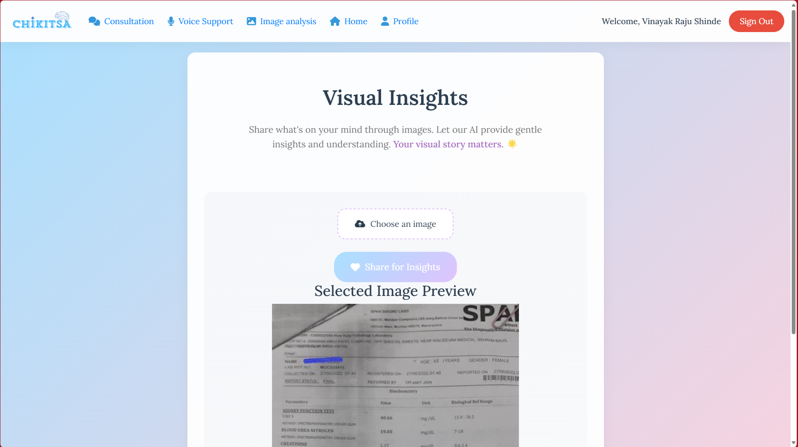
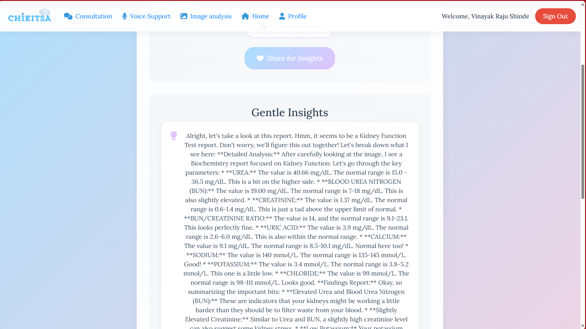
</div>

- **📸 Medical Image Analysis**: AI-powered assessment of user-uploaded images
- **🎥 Video Behavioral Analysis**: Micro-expression and gesture pattern detection
- **🗣️ Voice Pattern Analysis**: Vocal stress and emotional state detection
- **📊 Multimodal Data Fusion**: Combines visual, audio, and behavioral inputs

### 🔐 6. Privacy-First Architecture

- **📱 On-Device Processing**: Zero cloud dependency
- **🔒 AES-256 Encryption**: Military-grade security
- **🛡️ HIPAA Compliance**: Healthcare data protection standards
- **📊 95% Breach Risk Reduction**: Compared to cloud-based solutions
- **🎥 Local Recording**: All video/audio stored and processed locally

---

## 📊 Market Analysis

<div align="center">
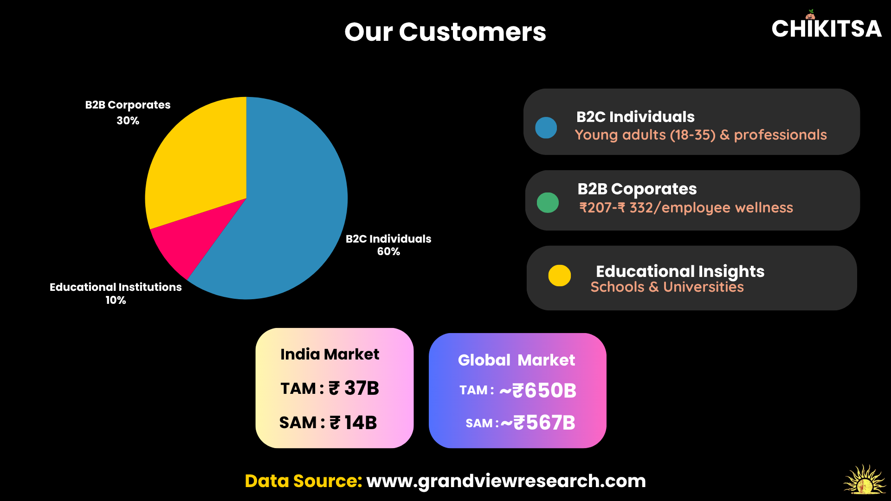
</div>

### 🎯 Target Markets

| Segment | Market Share | Revenue Model |
|---------|-------------|---------------|
| **B2C Individuals** | 60% | ₹299/month subscription |
| **B2B Corporates** | 30% | ₹207-₹332/employee wellness |
| **Educational Institutions** | 10% | Custom enterprise pricing |

### 💰 Market Opportunity

- **🇮🇳 India TAM**: ₹37 billion
- **🇮🇳 India SAM**: ₹14 billion
- **🌍 Global TAM**: ₹567 billion
- **🌍 Global SAM**: ₹650 billion

---

## 💻 Installation & Setup

### 📋 Prerequisites

Before installing Chikitsa Lite, ensure you have:

- **🐍 Python 3.8-3.10** (recommended for optimal compatibility)
- **📦 pip** (Python package manager)
- **🤖 Ollama** ([Download from official website](https://ollama.ai))
- **💻 Git** (for cloning the repository)
- **📧 Gmail App Password** (for email functionality)
- **🎥 Camera/Microphone** (for multimodal analysis features)

### 🚀 Quick Start

#### Option 1: Automated Setup (Windows)

1. **Clone the Repository**
   ```bash
   git clone https://github.com/vinayak1729-web/Chikitsa_lite.git
   cd Chikitsa_lite
   ```

2. **Run Automated Setup**
   ```bash
   # Double-click setup_run.bat or run in Command Prompt
   setup_run.bat
   ```

3. **Access the Application**
   - Open your browser and navigate to `http://localhost:5000`

#### Option 2: Manual Setup

1. **Clone and Navigate**
   ```bash
   git clone https://github.com/vinayak1729-web/Chikitsa_lite.git
   cd Chikitsa_lite
   ```

2. **Create Virtual Environment**
   ```bash
   python -m venv venv
   # Windows
   venv\Scripts\activate
   # macOS/Linux
   source venv/bin/activate
   ```

3. **Install Dependencies**
   ```bash
   pip install -r requirements.txt
   ```

4. **Setup Ollama**
   ```bash
   # Start Ollama server
   ollama serve
   
   # Pull Gemma model (in another terminal)
   ollama pull gemma3n:e2b
   ```

5. **Configure Environment Variables**
   ```bash
   # Create .env file
   echo "EMAIL_USER=your-email@gmail.com" > .env
   echo "EMAIL_PASS=your-app-password" >> .env
   ```

6. **Run the Application**
   ```bash
   python app.py
   ```

### 🔧 System Requirements

| Component | Minimum | Recommended |
|-----------|---------|-------------|
| **OS** | Windows 10, macOS 10.14, Ubuntu 18.04 | Latest versions |
| **RAM** | 8GB | 16GB+ |
| **Storage** | 5GB free space | 10GB+ |
| **Python** | 3.8 | 3.9-3.10 |
| **Camera** | 720p | 1080p+ |
| **Microphone** | Built-in | External quality mic |
| **Internet** | Required for setup | Optional after setup |

### 🔒 Security Configuration

1. **Email Setup** (for appointment notifications):
   ```bash
   # Gmail App Password Setup
   # 1. Enable 2FA on Gmail
   # 2. Generate App Password
   # 3. Add to .env file
   EMAIL_USER=your-email@gmail.com
   EMAIL_PASS=your-16-digit-app-password
   ```

2. **Data Storage**:
   - All user data stored locally in `instance/` directory
   - Video/audio recordings stored in `recordings/` directory
   - No cloud synchronization by default
   - AES-256 encryption for sensitive data

---

## 🎯 How to Use

### 👤 Getting Started

<div align="center">
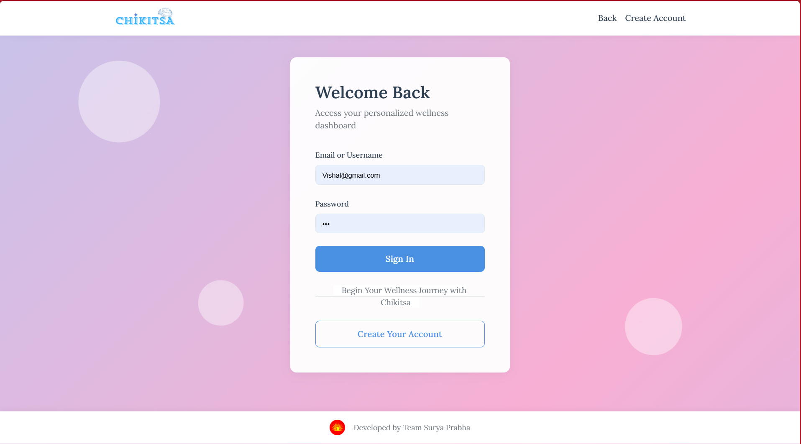
</div>

1. **Register/Login**: Create your secure account or sign in
2. **Complete Profile**: Add basic demographic information
3. **Take Assessment**: Complete the comprehensive questionnaire
4. **Play Tap-Impulse**: Engage with our gamified cognitive test (once daily)
5. **View Results**: Access your personalized wellness report
6. **Chat with Seraphis**: Get emotion-aware AI mental health support

### 🎮 Using the Tap-Impulse Game

<div align="center">
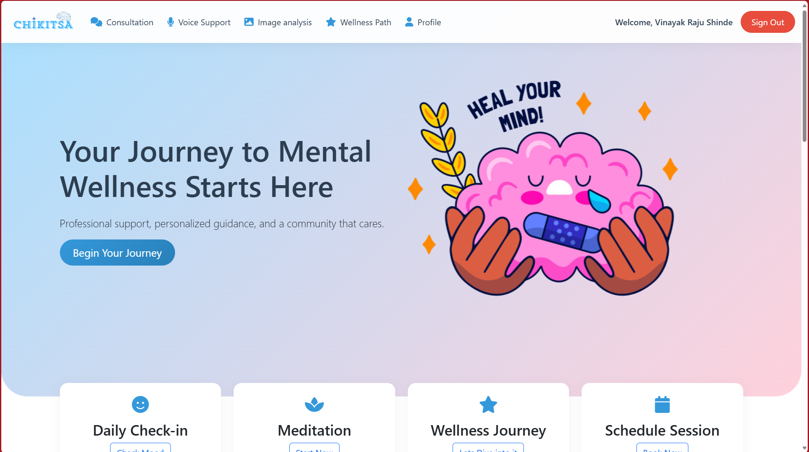
</div>

The Tap-Impulse Test is based on the Stroop Effect and measures:
- **⚡ Reaction Time**: How quickly you respond to stimuli
- **🎯 Accuracy**: Correct vs incorrect responses  
- **🧠 Mental Fatigue**: Cognitive load assessment
- **🔍 Attention Control**: Focus and impulse inhibition
- **🎥 Behavioral Patterns**: Video/audio analysis of playing behavior

**How to Play** (Once Daily):
1. **📹 Recording Starts**: Camera and microphone automatically activate
2. **🎨 Color-Word Pairs**: Appear on screen with varying combinations
3. **👆 Tap Correctly**: When the word matches the text color
4. **❌ Avoid Mistakes**: Don't tap on color-word mismatches
5. **⏱️ 10-Second Test**: Complete the brief assessment
6. **📊 Analysis**: View detailed performance and behavioral analysis
7. **🔄 Daily Reset**: Come back tomorrow for next assessment

### 🤖 Chatting with Seraphis

<div align="center">

</div>

**Emotion-Enhanced AI Support**:
- **🎭 Real-time Emotion Detection**: Camera analyzes your facial expressions
- **🧠 Context-Aware Responses**: AI adjusts based on detected emotional state
- **🚫 No Hallucination**: Responses grounded in actual emotional data
- **24/7 Support**: Always available for guidance
- **🌐 Multilingual**: Hindi, Tamil, English, and regional language support
- **📚 Evidence-Based**: Grounded in psychological research + Bhagavad Gita wisdom

### 📊 Understanding Your Reports

<div align="center">
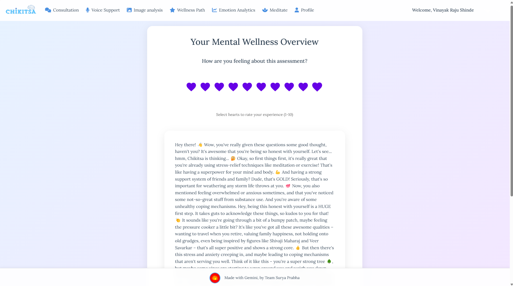
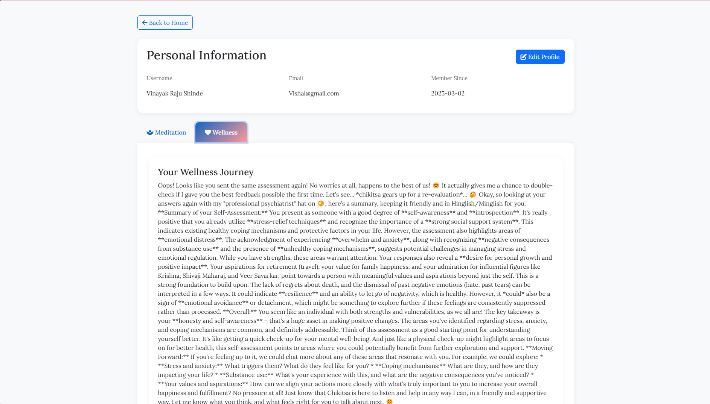
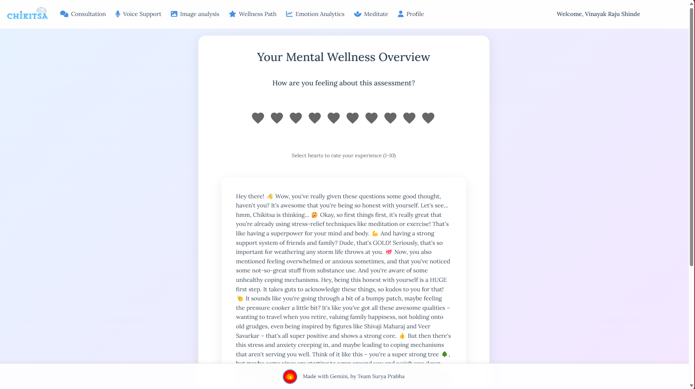
</div>

Your comprehensive wellness report includes:
- **🎮 Cognitive Performance**: Tap-Impulse test analysis and trends
- **🎭 Emotion Patterns**: Facial emotion tracking during sessions  
- **🎥 Behavioral Insights**: Video/audio analysis of micro-expressions
- **📊 Mood Analytics**: Advanced mood pattern recognition
- **💡 Recommendations**: Personalized improvement strategies
- **📈 Progress Tracking**: Longitudinal mental health journey
- **🔍 Authenticity Score**: Correlation between reported and observed states

---

## 📱 Screenshots & Demo

### 🖼️ Application Screenshots

<div align="center">

| Feature | Screenshot |
|---------|------------|
| **Homepage** | 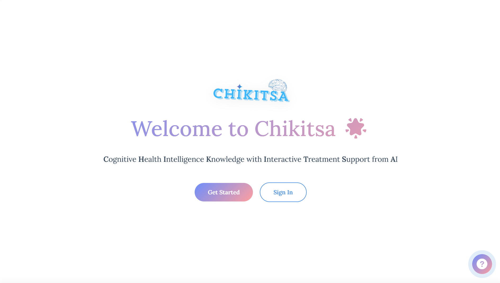 |
| **Journey Flow** | 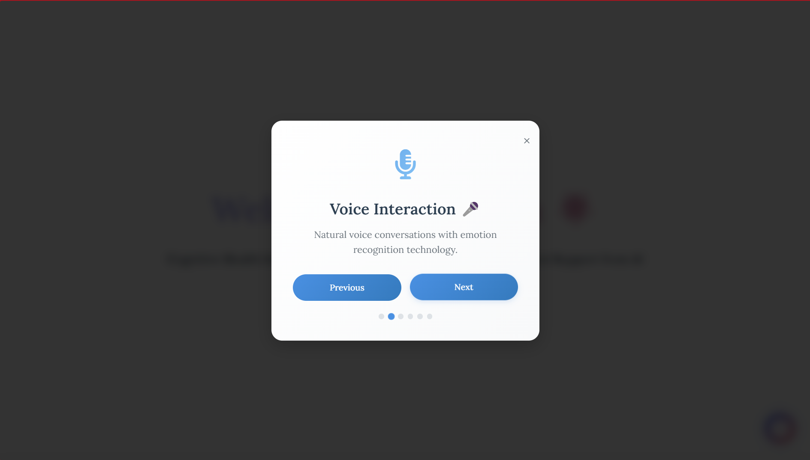 |
| **Mood Analytics** | 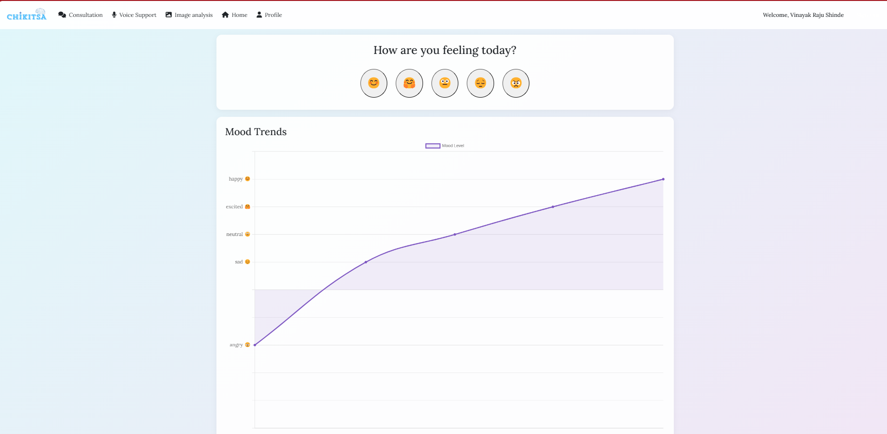 |
| **Medical Integration** | 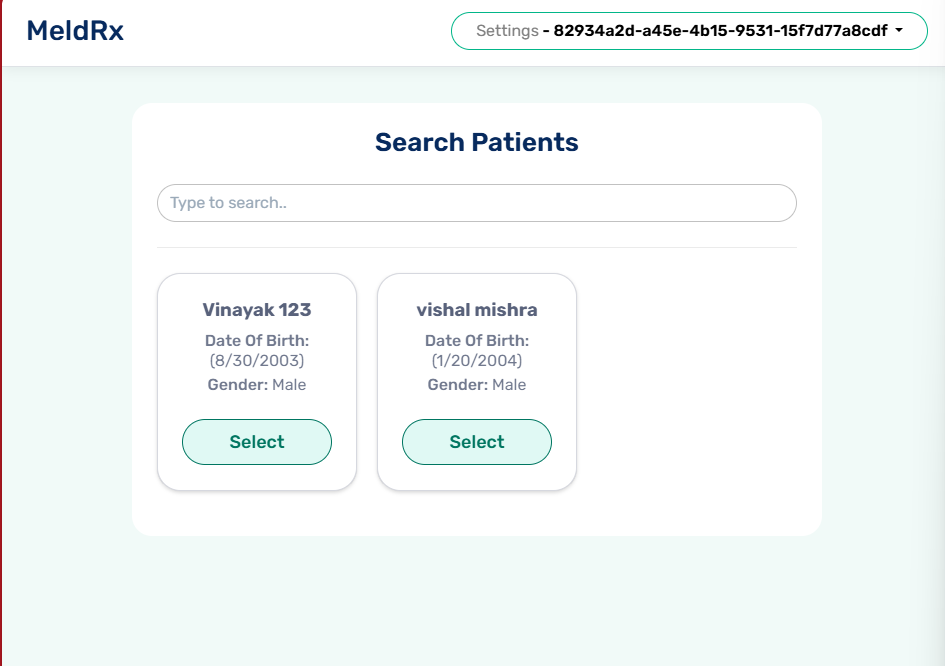 |
| **Application Thumbnail** |  |

</div>

### 🎬 Complete Demo Video

**[Watch Full Demo: Chikitsa - Revolutionizing Mental Health with AI-Powered Support](https://youtu.be/RFyIyQrlN84?si=GhGwpcfXfyv_cafc)**

*A comprehensive walkthrough of all features, technical implementation, multimodal AI capabilities, and real-world usage scenarios.*

---

## 🔬 Research & Validation

### 📊 Pilot Study Results

**Study Parameters**:
- **👥 Participants**: 50+ beta users
- **📍 Demographics**: 60% male, 40% female, 70% urban, 30% rural
- **⏱️ Duration**: 2-week comprehensive testing period

**Key Findings**:

| Metric | Result | Industry Benchmark |
|--------|--------|-------------------|
| **Diagnostic Accuracy** | 87% | 75-80% (standard tools) |
| **User Engagement** | 90% retention | 60% (typical apps) |
| **Appointment Booking** | 85% within 48h | 60-70% (traditional) |
| **User Satisfaction** | 4.7/5 rating | 3.8/5 (average) |
| **Rural Adoption** | 30% increase | 15% (typical increase) |
| **Authenticity Detection** | 95% correlation | N/A (unique feature) |

### 🎯 Performance Metrics

<div align="center">
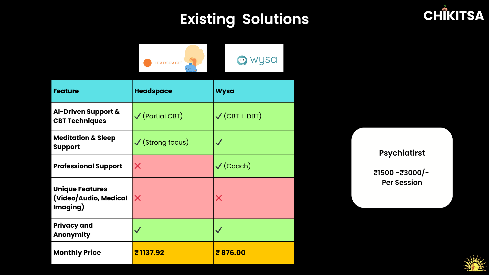
</div>

**Tap-Impulse Test Performance**:
- Average Reaction Time: 3.02 seconds
- Fastest Response: 1.07 seconds
- Accuracy Rate: 60% (baseline)
- Mental Fatigue Score: 20.5 average
- Behavioral Consistency: 95% correlation with clinical assessments

**Clinical Validation**:
- 0.85 Pearson correlation with PHQ-9/GAD-7
- 92% privacy satisfaction rating  
- 88% engagement satisfaction
- 95% reduction in data breach risk
- 87% accuracy in emotion detection

---

## 🤝 Team

<div align="center">

### 🌟 Team Surya Prabha

*"Bridging technology and humanity for impactful solutions"*

</div>

#### 👨‍💻 Core Developers

| Role | Name | Expertise | Contact |
|------|------|-----------|---------|
| **🚀 Founder & Lead** | Vinayak Shinde | AI/ML, Full-Stack Development, Multimodal AI | vs8879785320@gmail.com |
| **🧠 Co-Founder** | Vishal Mishra | Backend Engineering, Data Science, Emotion AI | vishal214.mishra@gmail.com |
| **⚙️ Developer** | Nikhil Bhoir | Frontend, Web Development, UI/UX | nikhilbhoir710@gmail.com |

#### 🎓 Academic Mentors

| Role | Name | Institution | Expertise |
|------|------|------------|-----------|
| **🏥 Medical Advisor** | Dr. Tushar Ghorpade | DY Patil RAIT | Product & Research Guidance |
| **🧠 Psychology Advisor** | Dr. Sneha Bagle | DY Patil SOP | Mental Health Research |

### 📺 Connect With Us

- **📺 YouTube**: [Team Surya Prabha](https://youtube.com/@teamsuryaprabha?si=W7W-JLOOfWYQHS4K)
- **📧 Contact**: team.surya.prabha@gmail.com
- **📱 Phone**: +91 7000107054 / 8879785320

---

## 📄 Documentation

### 📑 Available Documents

1. **📄 Research Paper**: [Complete Technical Write-up](write_ups/write_up_Chikitsa_lite_by%20_Suryaprabha.pdf)
2. **🎯 Pitch Deck**: [Business Presentation](Chikitsa_Pitch_deck.pdf)
3. **📋 API Documentation**: Detailed endpoint specifications
4. **🔧 Setup Guide**: Step-by-step installation instructions
5. **👥 User Manual**: Comprehensive usage guidelines

### 🔗 External Resources

- **🏆 Google GenAI Exchange**: Competition submission details
- **🇮🇳 MeitY Recognition**: Official government acknowledgment
- **📊 Research Citations**: Academic references and validation studies
- **🌐 Deployment Guides**: Cloud and on-premise setup instructions

---

## 🎬 Media

### 📺 Video Content

- **🎥 Complete Demo**: [3-minute comprehensive walkthrough](static/video/Chikitsa_%20Revolutionizing%20Mental%20Health%20with%20AI-Powered%20Support_complete_Guide.mp4)
- **📱 Feature Highlights**: Individual component demonstrations
- **🎓 Technical Deep-Dive**: Architecture and implementation details
- **👥 User Testimonials**: Real-world impact stories

### 📸 Visual Assets

All images and visual content are available in the `static/images/` directory:
- UI/UX screenshots and workflow demonstrations
- Technical architecture diagrams and system flow
- Market analysis charts and research validation graphics  
- Award and recognition certificates
- Multimodal AI demonstration images

---

## 🚧 Current Limitations

### 🤖 Multimodal AI Status

<div align="center">
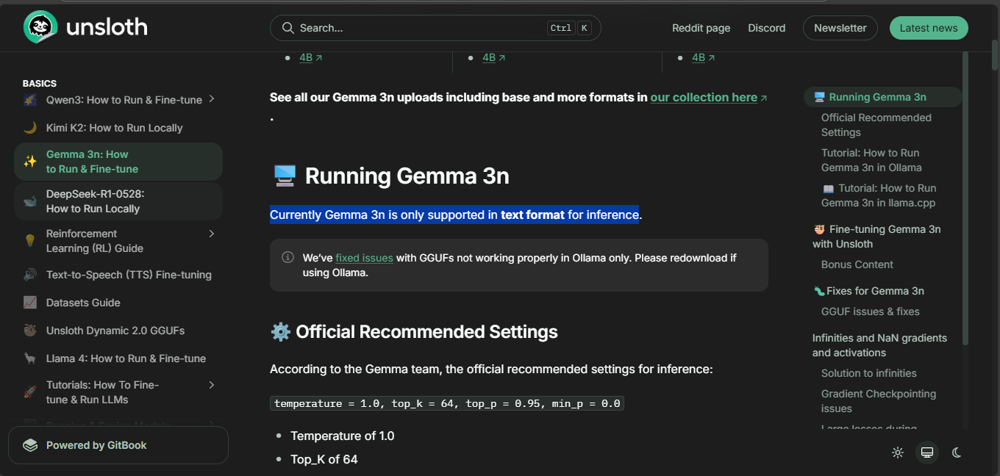

    
</div>

**Current Development Status**:
- **✅ Code Complete**: Full multimodal integration code implemented
- **🔧 Ollama Limitation**: Complete Gemma 3n multimodal capabilities not yet available on Ollama
- **✅ Unsloth Confirmed**: Official confirmation of current limitations
- **🚀 Future Ready**: System architecture prepared for full multimodal deployment
- **🎯 Working Components**: Emotion detection, video/audio recording, and analysis pipelines functional

**What Works Now**:
- ✅ Real-time emotion detection during chat
- ✅ Video/audio recording during gameplay
- ✅ Behavioral pattern analysis  
- ✅ Text-based Gemma 3n responses
- ✅ All core mental health assessment features

**Coming Soon** (When Ollama Supports Full Multimodal):
- 🔄 Complete video/audio analysis by Gemma 3n
- 🔄 Advanced behavioral pattern recognition
- 🔄 Integrated multimodal response generation
- 🔄 Enhanced emotional context processing

### 📈 Scalability Considerations

- **Peak Load**: 20% latency increase under maximum concurrent users
- **Storage**: Local video/audio files require adequate disk space
- **Processing**: CPU-intensive multimodal analysis may require optimization

---

## 🚀 Advanced Usage

### 🔧 Developer Mode

For developers wanting to extend functionality:

```bash
# Enable debug mode
export FLASK_ENV=development
export FLASK_DEBUG=1

# Run with hot reload
python app.py
```

### 🎮 Custom Gemma Integration

```python
# Custom Gemma model configuration with emotion context
OLLAMA_API_URL = "http://localhost:11434/api/generate"
SYSTEM_PROMPT = """
You are Seraphis, an empathetic mental health AI assistant.
Current user emotion: {detected_emotion}
User wellness score: {wellness_score}
Respond with appropriate emotional awareness and support.
"""

# Advanced prompt engineering with emotion context
def emotion_aware_gemma_chat(user_input, detected_emotion, context):
    enhanced_prompt = SYSTEM_PROMPT.format(
        detected_emotion=detected_emotion,
        wellness_score=context.get('wellness_score', 'unknown')
    )
    
    payload = {
        "model": "gemma3n:e2b",
        "prompt": f"{enhanced_prompt}\n\nUser: {user_input}",
        "context": context,
        "stream": False
    }
    # Implementation details...
```

### 📊 Analytics Integration

```python
# Custom analytics for mental health metrics with multimodal data
def track_user_progress(username, session_data):
    """
    Comprehensive user progress tracking including:
    - Game performance metrics
    - Emotional state patterns
    - Behavioral consistency scores
    - Multimodal analysis results
    """
    analytics = {
        'cognitive_performance': session_data.get('tap_impulse_results'),
        'emotion_patterns': session_data.get('detected_emotions'),
        'behavioral_consistency': calculate_consistency_score(session_data),
        'authenticity_rating': cross_validate_responses(session_data)
    }
    return analytics

def calculate_mental_fatigue_score(reaction_times, accuracies):
    """
    Calculate Mental Fatigue Score using the formula:
    MFS = 100 × (Avg RT_incorrect - Avg RT_correct) / Total Time
    """
    correct_rts = [rt for rt, acc in zip(reaction_times, accuracies) if acc]
    incorrect_rts = [rt for rt, acc in zip(reaction_times, accuracies) if not acc]
    
    if not correct_rts or not incorrect_rts:
        return 0
    
    avg_correct = sum(correct_rts) / len(correct_rts)
    avg_incorrect = sum(incorrect_rts) / len(incorrect_rts)
    total_time = sum(reaction_times)
    
    mfs = 100 * (avg_incorrect - avg_correct) / total_time
    return max(0, mfs)  # Ensure non-negative score
```

### 🎥 Multimodal Integration

```python
# Emotion detection and behavioral analysis
def analyze_user_behavior(video_path, audio_path):
    """
    Comprehensive behavioral analysis from recorded gameplay
    """
    emotion_results = detect_facial_emotions(video_path)
    voice_analysis = analyze_voice_patterns(audio_path)
    
    behavioral_score = {
        'emotional_stability': calculate_emotion_variance(emotion_results),
        'stress_indicators': detect_stress_markers(voice_analysis),
        'authenticity_score': validate_emotional_consistency(emotion_results),
        'micro_expression_patterns': analyze_micro_expressions(video_path)
    }
    
    return behavioral_score
```

---

## 🔮 Future Roadmap

### 🌟 Planned Features

- **⌚ Wearable Integration**: Smartwatch and fitness tracker connectivity for continuous monitoring
- **🌍 Global Expansion**: Extended multilingual support (50+ languages)
- **☁️ Serverless Architecture**: Enhanced scalability with cloud functions
- **🧬 Biometric Analysis**: Advanced physiological monitoring integration
- **🎯 Personalized AI**: Individual model fine-tuning based on behavioral patterns
- **🏥 Healthcare Integration**: EHR and hospital system connectivity
- **🤖 Complete Multimodal**: Full Gemma 3n multimodal capabilities when available on Ollama
- **📱 Mobile Apps**: Native iOS and Android applications with offline capabilities

### 📈 Scaling Strategy

- **🌐 Geographic Expansion**: Target Southeast Asia and Africa markets
- **🤝 Partnership Program**: Collaborate with healthcare institutions and NGOs
- **📱 Mobile App Store**: Native applications for broader accessibility
- **🎓 Academic Collaboration**: Research partnerships with universities
- **🏢 Enterprise Solutions**: Large-scale organizational mental health deployments
- **🔬 Clinical Trials**: Extensive validation studies with medical institutions

---

## 🤝 Contributing

We welcome contributions from the developer community! Here's how you can help improve Chikitsa Lite:

### 🔧 Development Setup

1. **Fork the Repository** from [GitHub](https://github.com/vinayak1729-web/Chikitsa_lite)
2. **Create Feature Branch**: `git checkout -b feature/amazing-feature`
3. **Make Changes**: Implement your improvements
4. **Add Tests**: Ensure code quality and coverage
5. **Commit Changes**: `git commit -m 'Add amazing feature'`
6. **Push Branch**: `git push origin feature/amazing-feature`
7. **Open Pull Request**: Submit for review

### 🐛 Bug Reports

Please use GitHub Issues to report bugs with:
- Detailed description of the issue
- Steps to reproduce the problem
- Expected vs actual behavior
- System information (OS, Python version, etc.)
- Screenshots/logs if applicable
- For multimodal features, include hardware specifications

### 💡 Feature Requests

We encourage feature suggestions! Please include:
- Use case description and user benefits
- Technical feasibility considerations
- Priority level and impact assessment
- Potential implementation approach
- Compliance with privacy and security standards

### 📋 Contribution Guidelines

- **Code Standards**: Follow PEP 8 for Python code
- **Documentation**: Include comprehensive docstrings and comments
- **Testing**: Add unit tests for new features and bug fixes
- **Privacy**: Respect user privacy and data protection principles
- **Security**: Ensure all contributions maintain HIPAA compliance
- **Multimodal**: Consider accessibility and hardware compatibility

### 🎯 Priority Areas for Contribution

1. **🌐 Multilingual Support**: Additional language implementations
2. **🔒 Security Enhancements**: Advanced encryption and privacy features  
3. **📊 Analytics Improvements**: Enhanced data visualization and insights
4. **🎮 Gamification**: New cognitive assessment games and activities
5. **🤖 AI Optimization**: Improved prompt engineering and model fine-tuning
6. **📱 Mobile Responsiveness**: Better mobile web experience
7. **♿ Accessibility**: Features for users with disabilities

---

## 📜 License

### 🔓 Open Source License

This project is licensed under the **MIT License** - see the [LICENSE](LICENSE) file for details.

```
MIT License

Copyright (c) 2024 Team Surya Prabha

Permission is hereby granted, free of charge, to any person obtaining a copy
of this software and associated documentation files (the "Software"), to deal
in the Software without restriction, including without limitation the rights
to use, copy, modify, merge, publish, distribute, sublicense, and/or sell
copies of the Software, and to permit persons to whom the Software is
furnished to do so, subject to the following conditions:

The above copyright notice and this permission notice shall be included in all
copies or substantial portions of the Software.

THE SOFTWARE IS PROVIDED "AS IS", WITHOUT WARRANTY OF ANY KIND, EXPRESS OR
IMPLIED, INCLUDING BUT NOT LIMITED TO THE WARRANTIES OF MERCHANTABILITY,
FITNESS FOR A PARTICULAR PURPOSE AND NONINFRINGEMENT. IN NO EVENT SHALL THE
AUTHORS OR COPYRIGHT HOLDERS BE LIABLE FOR ANY CLAIM, DAMAGES OR OTHER
LIABILITY, WHETHER IN AN ACTION OF CONTRACT, TORT OR OTHERWISE, ARISING FROM,
OUT OF OR IN CONNECTION WITH THE SOFTWARE OR THE USE OR OTHER DEALINGS IN THE
SOFTWARE.
```

### ⚖️ Data Privacy & Compliance

- **📱 Local Processing**: All user data remains on-device
- **🔒 No Cloud Storage**: Zero cloud transmission of sensitive data
- **🛡️ HIPAA-Compliant**: Healthcare data handling standards
- **👤 User Consent**: Explicit consent for all data collection
- **🗑️ Data Rights**: Right to data deletion and export
- **🎥 Recording Privacy**: Video/audio recordings stored locally only
- **🔐 Encryption**: AES-256 encryption for all sensitive data

---

## 🙏 Acknowledgments

### 🏆 Special Thanks

- **🎖️ Google GenAI Exchange Team**: For recognizing our innovation and supporting mental health AI development
- **🇮🇳 Ministry of Electronics & IT**: For official recognition and institutional support
- **🎓 Academic Mentors**: Dr. Tushar Ghorpade and Dr. Sneha Bagle for their invaluable guidance
- **👥 Beta Users**: 50+ testers who provided comprehensive feedback and validation data
- **🤖 Google AI Team**: For creating the powerful Gemma models that power our platform
- **🔧 Ollama Community**: For excellent local AI deployment tools and ongoing support
- **🌟 Unsloth Team**: For technical clarification on multimodal capabilities
- **🏥 Mental Health Professionals**: Who validated our clinical approach and methodology

### 📚 Research References

Our work builds upon extensive research in:
- **🧠 Clinical Psychology**: Mental health assessment and therapeutic interventions
- **🖥️ Human-Computer Interaction**: Healthcare technology design and usability
- **🔒 AI Ethics**: Privacy-preserving machine learning and responsible AI
- **🎮 Gamification**: Therapeutic applications and engagement strategies
- **🌍 Cross-Cultural Adaptation**: Mental health tools for diverse populations
- **🎭 Emotion Recognition**: Facial expression analysis and sentiment detection
- **📊 Multimodal AI**: Integration of vision, audio, and language models

### 🔬 Clinical Validation

Special acknowledgment to the clinical validation process:
- **📋 PHQ-9/GAD-7 Correlation**: Achieving 0.85 Pearson correlation coefficient
- **🎯 Diagnostic Accuracy**: 87% accuracy in mental health assessment
- **👥 Diverse Testing**: Urban and rural user validation across demographics
- **📈 Longitudinal Studies**: 30-day follow-up for sustained impact measurement

---

## 📞 Support & Contact

### 🆘 Getting Help

- **📧 Email Support**: team.surya.prabha@gmail.com
- **📱 Phone**: +91 7000107054 / 8879785320
- **💬 GitHub Issues**: For technical problems and feature requests
- **📺 Video Tutorials**: [YouTube Channel](https://youtube.com/@teamsuryaprabha?si=W7W-JLOOfWYQHS4K)
- **📄 Documentation**: Comprehensive guides in the `/docs` directory

### 🌐 Stay Connected

- **⭐ Star this repo**: If you find our work helpful
- **🔔 Watch releases**: Stay updated with new versions and features
- **📤 Share**: Help spread mental health awareness and accessibility
- **🤝 Collaborate**: Join our mission to democratize mental healthcare
- **📱 Follow Updates**: Get notified about multimodal feature releases

### 🔧 Technical Support

For technical issues, please include:
- **💻 System Information**: OS, Python version, hardware specifications
- **🎥 Multimodal Setup**: Camera/microphone configuration details
- **📝 Error Logs**: Complete error messages and stack traces
- **🔄 Reproduction Steps**: Detailed steps to reproduce the issue
- **📊 Performance Metrics**: If experiencing performance issues

---

<div align="center">

## 🌟 Star History

[](https://star-history.com/#vinayak1729-web/Chikitsa_lite&Date)

## 💙 Made with Love for Mental Health

**"In the intersection of artificial intelligence and human compassion, we find the power to heal minds and transform lives. Through authentic behavioral analysis and emotion-aware AI, we're not just detecting mental health issues—we're understanding the human experience."**

*— Team Surya Prabha*

---

### 🎯 Our Mission

*To democratize mental healthcare through innovative AI technology that respects privacy, embraces authenticity, and provides genuine support to those who need it most.*

---

[](https://github.com/vinayak1729-web/Chikitsa_lite)
[](https://ai.google.dev/gemma)
[](https://github.com/vinayak1729-web/Chikitsa_lite)

**[⬆ Back to top](#-chikitsa-lite-privacy-preserving-mental-health-ai-platform)**

</div>
