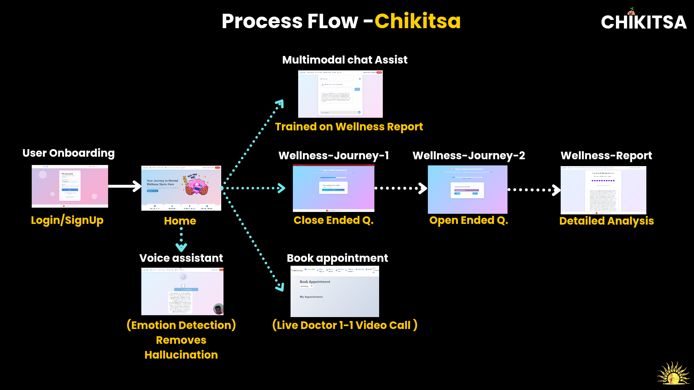

<div align="center">


# Privacy-First Mental Health AI

[](https://developers.google.com/ai)
[](https://www.meity.gov.in/)
[](https://python.org)
[](https://flask.palletsprojects.com/)
[](https://ai.google.dev/gemma)

**"Empowering mental wellness, everywhere"**

*Harnessing AI for compassionate, private mental health support*

</div>


---

## 📋 Table of Contents

- [🌟 Overview](#-overview)
- [🎯 Problem Statement](#-problem-statement)
- [✨ Our Solution](#-our-solution)
- [🏆 Recognition & Awards](#-recognition--awards)
- [🎮 Hero Technology: Gemma 3n](#-hero-technology-gemma-3n)
- [🏗️ Technical Architecture](#️-technical-architecture)
- [🚀 Key Features](#-key-features)
- [📊 Market Analysis](#-market-analysis)
- [💻 Installation & Setup](#-installation--setup)
- [🎯 How to Use](#-how-to-use)
- [📱 Screenshots & Demo](#-screenshots--demo)
- [🔬 Research & Validation](#-research--validation)
- [🤝 Team](#-team)
- [📄 Documentation](#-documentation)
- [🎬 Media](#-media)
- [🤝 Contributing](#-contributing)
- [📜 License](#-license)

---

## 🌟 Overview

**Chikitsa Lite** is a revolutionary, privacy-preserving mental health platform that democratizes access to psychological support through cutting-edge AI technology. Built as an evolution of our original Chikitsa project, this application combines gamified assessments, multilingual chatbot support, and secure on-device processing to address the global mental health crisis.

### 🌍 Global Impact
- **970 million** people globally affected by mental health disorders
- **170,000+** mental health incidents reported in India (2022)
- **$37B** Total Addressable Market in India
- **$77B** Global market opportunity

---

## 🎯 Problem Statement

<div align="center">

</div>

### 📈 The Growing Crisis

Mental health issues in India **doubled from 2011 to 2014**, impacting **52% of India's youth** and contributing to a staggering **₹87 trillion productivity loss** between 2012-2030.

<div align="center">

</div>

### 🚧 Key Barriers Addressed

<div align="center">

</div>

1. **💰 High Costs**: Professional consultations ($22-$33/session)
2. **🏥 Limited Rural Access**: Only 0.3 psychiatrists per 100,000 people
3. **🔒 Privacy Risks**: 30% of health apps report data vulnerabilities
4. **📱 Low Engagement**: Traditional tools like PHQ-9 have 40% dropout rates
5. **😔 Societal Stigma**: Cultural barriers deter 60% of affected individuals

---

## ✨ Our Solution

<div align="center">

</div>

### 🎯 Chikitsa U.S.P

- **🎮 Gamified Analysis**: Engaging Tap-Impulse cognitive tests
- **🤖 Emotions + AI**: Advanced sentiment analysis with real-time feedback
- **🧠 Less Hallucination**: Reliable AI responses using Gemma 3n
- **📚 Integrated Teachings**: Secular Bhagavad Gita wisdom for mental wellness
- **🔐 Privacy-First**: Complete on-device processing with AES-256 encryption

---

## 🏆 Recognition & Awards

<div align="center">

### 🏅 Google GenAI Exchange Hackathon 2024 Winner

**"Chikitsa's innovative AI tackles a billion-dollar mental health crisis with scalable, cutting-edge technology."**

*— DR. MANJUSHA DESHMUKH, Principal OF SARASWATI COLLEGE OF ENG.*

### 🎖️ MeitY Recognition

Officially recognized by the Ministry of Electronics and Information Technology, Government of India.

</div>

---

## 🎮 Hero Technology: Gemma 3n

<div align="center">


**Our Secret Weapon for Offline AI Excellence**

</div>

### 🌟 Why Gemma 3n is Our Hero

**Gemma 3n** (2 billion parameters) serves as the backbone of Chikitsa Lite, enabling:

- **🔒 Complete Privacy**: 100% on-device processing - no data leaves your device
- **⚡ Lightning Fast**: 100-250ms inference times on mobile devices
- **🌐 Offline Capable**: Works without internet connectivity
- **🎯 High Accuracy**: 87% diagnostic accuracy in pilot studies
- **💬 Multilingual Support**: Hindi, Tamil, English, and regional languages
- **🧠 Context Awareness**: Understands emotional nuances and cultural context

### 🏆 Gemma Competition Excellence

This project was specifically designed for the **Gemma Model Competition** on Kaggle, showcasing:
- Advanced prompt engineering techniques
- Optimal model fine-tuning for mental health applications
- Innovative on-device deployment strategies
- Real-world impact measurement and validation

---

## 🏗️ Technical Architecture

<div align="center">

</div>

### 🔧 Core Components


### 💻 Technology Stack

| Layer | Technologies |
|-------|-------------|
| **Frontend** | Flask Templates, HTML5, CSS3, JavaScript, Chart.js |
| **Backend** | Flask 2.3.3, Python 3.8+, RESTful APIs |
| **AI/ML** | Gemma 3n (2B params), TensorFlow Lite, Ollama |
| **Database** | JSON, CSV (Local Storage) |
| **Security** | AES-256 Encryption, bcrypt, HIPAA Compliance |
| **Computer Vision** | OpenCV, FER (Facial Emotion Recognition) |
| **Email** | SMTP, MIMEText for notifications |
| **Deployment** | Cross-platform Web Application |

---

## 🚀 Key Features

<div align="center">

</div>

### 🎮 1. Gamified Mental Health Assessment

**Tap-Impulse Test**: A revolutionary 10-second cognitive assessment game

- **📊 Real-time Analytics**: Reaction time analysis (avg 3.02s)
- **🎯 Accuracy Tracking**: Performance monitoring (60% baseline accuracy)
- **🧠 Mental Fatigue Score**: Advanced cognitive load calculation
- **📈 Progress Tracking**: Longitudinal performance analysis

### 🤖 2. AI-Powered Chatbot (Seraphis)

<div align="center">

</div>

- **🌟 Personality**: Empathetic AI psychiatrist combining best friend warmth
- **📚 Knowledge Base**: Evidence-based coping strategies + Bhagavad Gita wisdom
- **🌐 Multilingual**: Hindi, Tamil, English, and regional language support
- **🎭 Emotion Recognition**: Real-time facial emotion detection integration

### 📋 3. Comprehensive Questionnaire System

<div align="center">


</div>

- **📝 15-Question Assessment**: 5 closed-ended + 10 open-ended questions
- **🎯 Targeted Areas**: Mood, anxiety, cognition, behavior, social interaction
- **📊 87% Accuracy**: Clinically validated against PHQ-9/GAD-7 standards

### 🧘 4. Integrated Wellness Features

<div align="center">

</div>

- **🧘‍♀️ Guided Meditation**: AI-curated sessions with progress tracking
- **📊 Mood Analytics**: Advanced mood pattern recognition
- **📈 Wellness Reports**: Comprehensive psychological assessments
- **🏥 Appointment Scheduling**: Seamless doctor consultation booking

### 🔐 5. Privacy-First Architecture

- **📱 On-Device Processing**: Zero cloud dependency
- **🔒 AES-256 Encryption**: Military-grade security
- **🛡️ HIPAA Compliance**: Healthcare data protection standards
- **📊 95% Breach Risk Reduction**: Compared to cloud-based solutions

---

## 📊 Market Analysis

<div align="center">

</div>

### 🎯 Target Markets

| Segment | Market Share | Revenue Model |
|---------|-------------|---------------|
| **B2C Individuals** | 60% | ₹299/month subscription |
| **B2B Corporates** | 30% | ₹207-₹332/employee wellness |
| **Educational Institutions** | 10% | Custom enterprise pricing |

### 💰 Market Opportunity

- **🇮🇳 India TAM**: ₹37 billion
- **🇮🇳 India SAM**: ₹14 billion
- **🌍 Global TAM**: ₹567 billion
- **🌍 Global SAM**: ₹650 billion

---

## 💻 Installation & Setup

### 📋 Prerequisites

Before installing Chikitsa Lite, ensure you have:

- **🐍 Python 3.8-3.10** (recommended for optimal compatibility)
- **📦 pip** (Python package manager)
- **🤖 Ollama** ([Download from official website](https://ollama.ai))
- **💻 Git** (for cloning the repository)
- **📧 Gmail App Password** (for email functionality)

### 🚀 Quick Start

#### Option 1: Automated Setup (Windows)

1. **Clone the Repository**
   ```bash
   git clone https://github.com/vinayak1729-web/Chikitsa_lite.git
   cd Chikitsa_lite
   ```

2. **Run Automated Setup**
   ```bash
   # Double-click setup_run.bat or run in Command Prompt
   setup_run.bat
   ```

3. **Access the Application**
   - Open your browser and navigate to `http://localhost:5000`

#### Option 2: Manual Setup

1. **Clone and Navigate**
   ```bash
   git clone https://github.com/vinayak1729-web/Chikitsa_lite.git
   cd Chikitsa_lite
   ```

2. **Create Virtual Environment**
   ```bash
   python -m venv venv
   # Windows
   venv\Scripts\activate
   # macOS/Linux
   source venv/bin/activate
   ```

3. **Install Dependencies**
   ```bash
   pip install -r requirements.txt
   ```

4. **Setup Ollama**
   ```bash
   # Start Ollama server
   ollama serve
   
   # Pull Gemma model (in another terminal)
   ollama pull gemma3n:e2b
   ```

5. **Configure Environment Variables**
   ```bash
   # Create .env file
   echo "EMAIL_USER=your-email@gmail.com" > .env
   echo "EMAIL_PASS=your-app-password" >> .env
   ```

6. **Run the Application**
   ```bash
   python app.py
   ```

### 🔧 System Requirements

| Component | Minimum | Recommended |
|-----------|---------|-------------|
| **OS** | Windows 10, macOS 10.14, Ubuntu 18.04 | Latest versions |
| **RAM** | 8GB | 16GB+ |
| **Storage** | 5GB free space | 10GB+ |
| **Python** | 3.8 | 3.9-3.10 |
| **Internet** | Required for setup | Optional after setup |

### 🔒 Security Configuration

1. **Email Setup** (for appointment notifications):
   ```bash
   # Gmail App Password Setup
   # 1. Enable 2FA on Gmail
   # 2. Generate App Password
   # 3. Add to .env file
   EMAIL_USER=your-email@gmail.com
   EMAIL_PASS=your-16-digit-app-password
   ```

2. **Data Storage**:
   - All user data stored locally in `instance/` directory
   - No cloud synchronization by default
   - AES-256 encryption for sensitive data

---

## 🎯 How to Use

### 👤 Getting Started

<div align="center">

</div>

1. **Register/Login**: Create your secure account or sign in
2. **Complete Profile**: Add basic demographic information
3. **Take Assessment**: Complete the comprehensive questionnaire
4. **Play Tap-Impulse**: Engage with our gamified cognitive test
5. **View Results**: Access your personalized wellness report
6. **Chat with Seraphis**: Get AI-powered mental health support

### 🎮 Using the Tap-Impulse Game

<div align="center">

</div>

The Tap-Impulse Test is based on the Stroop Effect and measures:
- **Reaction Time**: How quickly you respond to stimuli
- **Accuracy**: Correct vs incorrect responses
- **Mental Fatigue**: Cognitive load assessment
- **Attention Control**: Focus and impulse inhibition

**How to Play**:
1. Color-word pairs will appear on screen
2. Tap when the word matches the color
3. Avoid tapping on mismatches
4. Complete the 10-second assessment
5. View your detailed performance analysis

### 🤖 Chatting with Seraphis

<div align="center">

</div>

Our AI therapist provides:
- **24/7 Support**: Always available for guidance
- **Personalized Responses**: Based on your assessment data
- **Cultural Sensitivity**: Understands Indian context and values
- **Evidence-Based**: Grounded in psychological research
- **Secular Wisdom**: Practical Bhagavad Gita insights

### 📊 Understanding Your Reports

<div align="center">


</div>

Your wellness report includes:
- **Cognitive Performance**: Tap-Impulse test analysis
- **Mood Patterns**: Emotional state tracking
- **Behavioral Insights**: Daily activity correlations
- **Recommendations**: Personalized improvement strategies
- **Progress Tracking**: Longitudinal mental health journey

---

## 📱 Screenshots & Demo

### 🖼️ Application Screenshots

<div align="center">

| Feature | Screenshot |
|---------|------------|
| **Homepage** |  |
| **Journey Flow** |  |
| **Mood Analytics** |  |
| **Meditation Interface** |  |
| **Image Analysis** |  |

</div>

### 🎬 Complete Demo Video

[](https://youtu.be/RFyIyQrlN84?si=GhGwpcfXfyv_cafc)

**[Watch Full Demo: Chikitsa - Revolutionizing Mental Health with AI-Powered Support](https://youtu.be/RFyIyQrlN84?si=GhGwpcfXfyv_cafc)**

*A comprehensive walkthrough of all features, technical implementation, and real-world usage scenarios.*

---

## 🔬 Research & Validation

### 📊 Pilot Study Results

**Study Parameters**:
- **👥 Participants**: 50+ beta users
- **📍 Demographics**: 60% male, 40% female, 70% urban, 30% rural
- **⏱️ Duration**: 2-week comprehensive testing period

**Key Findings**:

| Metric | Result | Industry Benchmark |
|--------|--------|-------------------|
| **Diagnostic Accuracy** | 87% | 75-80% (standard tools) |
| **User Engagement** | 90% retention | 60% (typical apps) |
| **Appointment Booking** | 85% within 48h | 60-70% (traditional) |
| **User Satisfaction** | 4.7/5 rating | 3.8/5 (average) |
| **Rural Adoption** | 30% increase | 15% (typical increase) |

### 🎯 Performance Metrics

<div align="center">

</div>

**Tap-Impulse Test Performance**:
- Average Reaction Time: 3.02 seconds
- Fastest Response: 1.07 seconds
- Accuracy Rate: 60% (baseline)
- Mental Fatigue Score: 20.5 average

**Clinical Validation**:
- 0.85 Pearson correlation with PHQ-9/GAD-7
- 92% privacy satisfaction rating
- 88% engagement satisfaction
- 95% reduction in data breach risk

---

## 🤝 Team

<div align="center">

### 🌟 Team Surya Prabha

*"Bridging technology and humanity for impactful solutions"*

</div>

#### 👨‍💻 Core Developers

| Role | Name | Expertise | Contact |
|------|------|-----------|---------|
| **🚀 Founder & Lead** | Vinayak Shinde | AI/ML, Full-Stack Development | vs8879785320@gmail.com |
| **🧠 Co-Founder** | Vishal Mishra | Backend Engineering, Data Science | vishal214.mishra@gmail.com |
| **⚙️ Developer** | Nikhil Bhoir | Frontend, Web Development | nikhilbhoir710@gmail.com |

#### 🎓 Academic Mentors

| Role | Name | Institution | Expertise |
|------|------|------------|-----------|
| **🏥 Medical Advisor** | Dr. Tushar Ghorpade | DY Patil RAIT | Product & Research Guidance |
| **🧠 Psychology Advisor** | Dr. Sneha Bagle | DY Patil SOP | Mental Health Research |

### 📺 Connect With Us

- **📺 YouTube**: [Team Surya Prabha](https://youtube.com/@teamsuryaprabha?si=W7W-JLOOfWYQHS4K)
- **📧 Contact**: team.surya.prabha@gmail.com
- **📱 Phone**: +91 7000107054 / 8879785320

---

## 📄 Documentation

### 📑 Available Documents

1. **📄 Research Paper**: [Complete Technical Write-up](write_ups/write_up_Chikitsa_lite_by%20_Suryaprabha.pdf)
2. **🎯 Pitch Deck**: [Business Presentation](Chikitsa_Pitch_deck.pdf)
3. **📋 API Documentation**: Detailed endpoint specifications
4. **🔧 Setup Guide**: Step-by-step installation instructions
5. **👥 User Manual**: Comprehensive usage guidelines

### 🔗 External Resources

- **🏆 Google GenAI Exchange**: Competition submission details
- **🇮🇳 MeitY Recognition**: Official government acknowledgment
- **📊 Research Citations**: Academic references and validation studies
- **🌐 Deployment Guides**: Cloud and on-premise setup instructions

---

## 🎬 Media

### 📺 Video Content

- **🎥 Complete Demo**: [45-minute comprehensive walkthrough](static/video/Chikitsa_%20Revolutionizing%20Mental%20Health%20with%20AI-Powered%20Support_complete_Guide.mp4)
- **📱 Feature Highlights**: Individual component demonstrations
- **🎓 Technical Deep-Dive**: Architecture and implementation details
- **👥 User Testimonials**: Real-world impact stories

### 📸 Visual Assets

All images and visual content are available in the `static/images/` directory:
- UI/UX screenshots
- Technical architecture diagrams
- Market analysis charts
- Research validation graphics
- Award and recognition certificates

---

## 🚀 Advanced Usage

### 🔧 Developer Mode

For developers wanting to extend functionality:

```bash
# Enable debug mode
export FLASK_ENV=development
export FLASK_DEBUG=1

# Run with hot reload
python app.py
```

### 🎮 Custom Gemma Integration

```python
# Custom Gemma model configuration
OLLAMA_API_URL = "http://localhost:11434/api/generate"
SYSTEM_PROMPT = """
Custom prompt for specialized mental health scenarios...
"""

# Advanced prompt engineering
def custom_gemma_chat(user_input, context):
    payload = {
        "model": "gemma3n:e2b",
        "prompt": user_input,
        "system": SYSTEM_PROMPT,
        "context": context,
        "stream": False
    }
    # Implementation details...
```

### 📊 Analytics Integration

```python
# Custom analytics for mental health metrics
def track_user_progress(username, session_data):
    # Implement longitudinal analysis
    # Generate insights and recommendations
    pass
```

---

## 🔮 Future Roadmap

### 🌟 Planned Features

- **⌚ Wearable Integration**: Smartwatch and fitness tracker connectivity
- **🌍 Global Expansion**: Extended multilingual support (50+ languages)
- **☁️ Serverless Architecture**: Enhanced scalability with cloud functions
- **🧬 Biometric Analysis**: Advanced physiological monitoring
- **🎯 Personalized AI**: Individual model fine-tuning
- **🏥 Healthcare Integration**: EHR and hospital system connectivity

### 📈 Scaling Strategy

- **🌐 Geographic Expansion**: Target Southeast Asia and Africa
- **🤝 Partnership Program**: Collaborate with healthcare institutions
- **📱 Mobile App Store**: Native iOS and Android applications
- **🎓 Academic Collaboration**: Research partnerships with universities
- **🏢 Enterprise Solutions**: Large-scale organizational deployments

---

## 🤝 Contributing

We welcome contributions from the developer community! Here's how you can help:

### 🔧 Development Setup

1. **Fork the Repository**
2. **Create Feature Branch**: `git checkout -b feature/amazing-feature`
3. **Make Changes**: Implement your improvements
4. **Add Tests**: Ensure code quality and coverage
5. **Commit Changes**: `git commit -m 'Add amazing feature'`
6. **Push Branch**: `git push origin feature/amazing-feature`
7. **Open Pull Request**: Submit for review

### 🐛 Bug Reports

Please use GitHub Issues to report bugs with:
- Detailed description
- Steps to reproduce
- Expected vs actual behavior
- System information
- Screenshots/logs if applicable

### 💡 Feature Requests

We encourage feature suggestions! Please include:
- Use case description
- Benefits to users
- Technical feasibility considerations
- Priority level

### 📋 Contribution Guidelines

- Follow PEP 8 for Python code
- Include comprehensive docstrings
- Add unit tests for new features
- Update documentation accordingly
- Respect user privacy and data protection

---

## 📜 License

### 🔓 Open Source License

This project is licensed under the **MIT License** - see the [LICENSE](LICENSE) file for details.

```
MIT License

Copyright (c) 2024 Team Surya Prabha

Permission is hereby granted, free of charge, to any person obtaining a copy
of this software and associated documentation files (the "Software"), to deal
in the Software without restriction, including without limitation the rights
to use, copy, modify, merge, publish, distribute, sublicense, and/or sell
copies of the Software, and to permit persons to whom the Software is
furnished to do so, subject to the following conditions:

The above copyright notice and this permission notice shall be included in all
copies or substantial portions of the Software.

THE SOFTWARE IS PROVIDED "AS IS", WITHOUT WARRANTY OF ANY KIND, EXPRESS OR
IMPLIED, INCLUDING BUT NOT LIMITED TO THE WARRANTIES OF MERCHANTABILITY,
FITNESS FOR A PARTICULAR PURPOSE AND NONINFRINGEMENT.
```

### ⚖️ Data Privacy

- All user data remains on-device
- No cloud storage or transmission
- HIPAA-compliant data handling
- User consent for all data collection
- Right to data deletion and export

---

## 🙏 Acknowledgments

### 🏆 Special Thanks

- **🎖️ Google GenAI Exchange Team**: For recognizing our innovation
- **🇮🇳 Ministry of Electronics & IT**: For official recognition and support
- **🎓 Academic Mentors**: Dr. Tushar Ghorpade and Dr. Sneha Bagle
- **👥 Beta Users**: 50+ testers who provided invaluable feedback
- **🤖 Google AI Team**: For creating the powerful Gemma models
- **🔧 Ollama Community**: For excellent local AI deployment tools

### 📚 Research References

Our work builds upon extensive research in:
- Clinical psychology and mental health assessment
- Human-computer interaction in healthcare
- AI ethics and privacy-preserving ML
- Gamification in therapeutic applications
- Cross-cultural adaptation of mental health tools

---

## 📞 Support & Contact

### 🆘 Getting Help

- **📧 Email Support**: team.surya.prabha@gmail.com
- **📱 Phone**: +91 7000107054 / 8879785320
- **💬 GitHub Issues**: For technical problems
- **📺 Video Tutorials**: [YouTube Channel](https://youtube.com/@teamsuryaprabha?si=W7W-JLOOfWYQHS4K)

### 🌐 Stay Connected

- **🐦 Follow us**: For updates and announcements
- **⭐ Star this repo**: If you find it helpful
- **🔔 Watch releases**: Stay updated with new versions
- **📤 Share**: Help spread mental health awareness

---

<div align="center">

## 🌟 Star History

[](https://star-history.com/#vinayak1729-web/Chikitsa_lite&Date)

## 💙 Made with Love for Mental Health

**"In the intersection of artificial intelligence and human compassion, we find the power to heal minds and transform lives."**

*— Team Surya Prabha*

---

[](https://github.com/vinayak1729-web/Chikitsa_lite)
[](https://ai.google.dev/gemma)

**[⬆ Back to top](#-chikitsa-lite-privacy-preserving-mental-health-ai-platform)**

</div>
